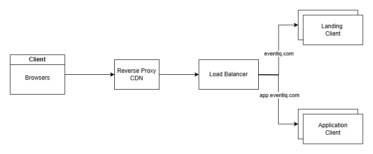

# EventIQ - System Architecture

### Backend Architecture
This diagram shows the core services that power EventIQ. Events from client SDKs are ingested via a public endpoint and processed asynchronously using messaging queues. Services are decoupled and horizontally scalable, and analytics data is served efficiently using a combination of databases and caching. The system prioritizes high availability, low latency, and real-time insights.

### Frontend Architecture
The frontend system for EventIQ is designed using a subdomain-based deployment model to separate the landing (marketing) site from the authenticated dashboard application. Both are independently developed React projects, delivered through a shared CDN and reverse proxy, and routed via a single load balancer based on the requested subdomain.

